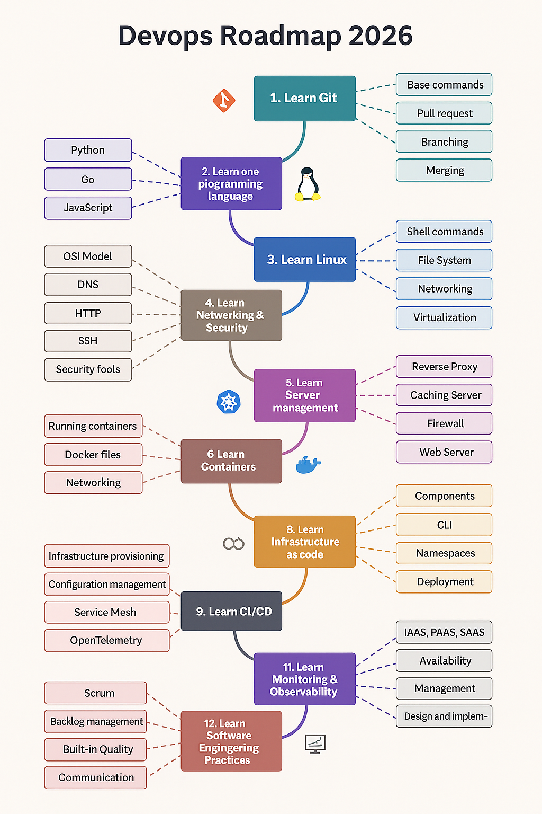
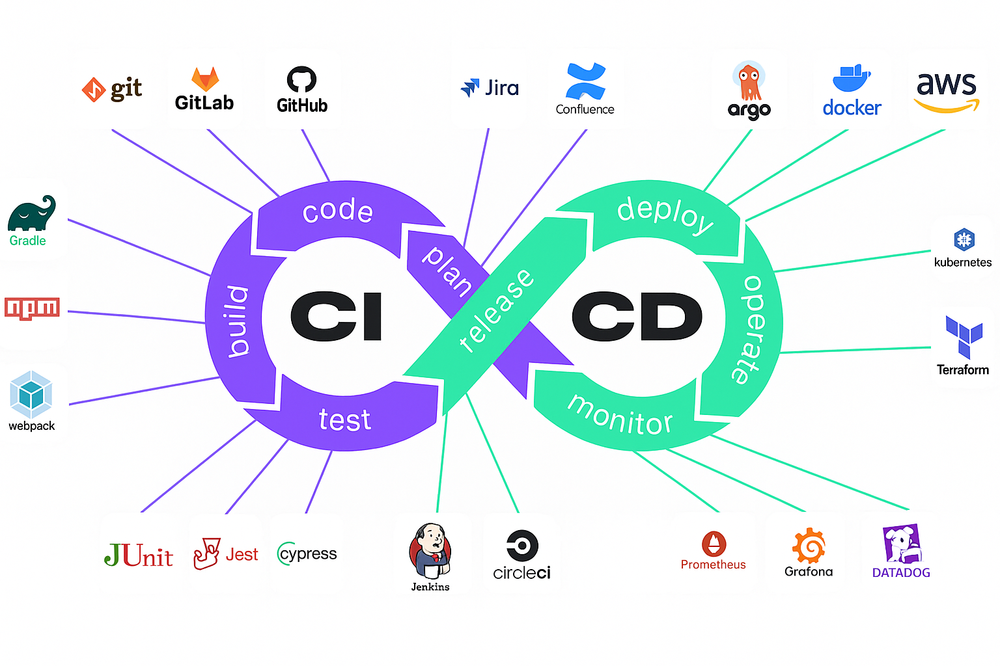

# DevOps Learning Roadmap 2026

A simplified, step-by-step guide to becoming a DevOps Engineer with curated learning resources.

**[follow](https://github.com/arumullayaswanth) and Click ⭐ if you like the project. Pull Requests are highly appreciated.**

**[follow Youtube](https://www.youtube.com/@Yashacademy0)**
**[follow linkedin](https://www.linkedin.com/in/yaswanth-arumulla/)**
**[follow medium](https://medium.com/@yaswanth.arumulla)**
---

<!-- YouTube / Social section added -->
## Use This Repo In Your YouTube Video

If you're creating a video from this roadmap, feel free to use the repository and the resources below. Copy the description template from `youtube_description.md` and the short social post from `social_post.md`.

Quick links:

- **Repo:** https://github.com/arumullayaswanth/Devops-Roadmap-2026
- **License:** Apache 2.0

---

**Curated courses:** See `resources/courses.md` for a short, categorized list of recommended courses and links to learn-by-doing resources.


## 📋 Table of Contents

1. [Introduction](#introduction)
2. [Learning Path](#learning-path)
   - [1. Git Version Control](#1-git-version-control)
   - [2. Programming Language](#2-programming-language)
   - [3. Linux & Scripting](#3-linux--scripting)
   - [4. Networking & Security](#4-networking--security)
   - [5. Server Management](#5-server-management)
   - [6. Containers](#6-containers)
   - [7. Container Orchestration](#7-container-orchestration)
   - [8. Infrastructure as Code](#8-infrastructure-as-code)
   - [9. CI/CD](#9-cicd)
   - [10. Monitoring & Observability](#10-monitoring--observability)
   - [11. Cloud Providers](#11-cloud-providers)
   - [12. Software Engineering Practices](#12-software-engineering-practices)
   - [13. AI & DevOps](#13-ai--devops)
   - [14. Platform Engineering](#14-platform-engineering)
   - [15. DevSecOps](#15-devsecops)
3. [DevOps Tools Overview](#devops-tools-overview)
4. [Recommended Books](#recommended-books)
5. [Contributing](#contributing)
6. [License](#license)

---

## Introduction



DevOps combines software development (Dev) and IT operations (Ops) to shorten the development lifecycle and deliver high-quality software continuously. This roadmap provides a structured learning path with free and premium resources.

### What is DevOps?

DevOps is a culture and set of practices that brings together software development and operations teams to:
- **Automate** infrastructure and deployment processes
- **Collaborate** more effectively across teams
- **Deliver** software faster and more reliably
- **Monitor** and improve continuously

---

## Learning Path

### 1. Git Version Control

**What You'll Learn:**
- Git fundamentals (clone, commit, push, pull)
- Branching and merging strategies
- Collaboration with pull requests
- GitHub/GitLab workflows

**Free Resources:**
- [Pro Git Book](https://git-scm.com/book/en/v2) - Comprehensive guide
- [Learn Git Branching](https://learngitbranching.js.org/) - Interactive tutorial
- [Atlassian Git Tutorials](https://www.atlassian.com/git) - Practical guides
- [Git Command Explorer](https://gitexplorer.com/) - Find the right commands

**Video Tutorials:**
- [Git & GitHub Tutorial - freeCodeCamp](https://www.youtube.com/watch?v=S7XpTAnSDL4)
- [Advanced Git Tutorial](https://www.youtube.com/watch?v=qsTthZi23VE)

**Key Concepts:**
- Repositories and commits
- Branches and merges
- Remote repositories
- Conflict resolution
- Pull requests and code reviews

---

### 2. Programming Language

**What You'll Learn:**
- Basic programming syntax
- Data structures and algorithms
- Automation scripting
- API interaction

**Choose One Primary Language:**

#### 🐍 Python (Recommended for Beginners)
- **Why Python?** Easy to learn, great for automation, widely used in DevOps
- [Automate the Boring Stuff with Python](https://automatetheboringstuff.com/) - Free book
- [Python Crash Course](https://ehmatthes.github.io/pcc/) - Free resource

#### 🐹 Go (Golang)
- **Why Go?** Fast, efficient, used by many DevOps tools (Docker, Kubernetes)
- [Go by Example](https://gobyexample.com/) - Hands-on introduction
- [Learn Go with Tests](https://quii.gitbook.io/learn-go-with-tests) - TDD approach

#### 📜 JavaScript
- **Why JavaScript?** Useful for web automation and Node.js tools
- [The Modern JavaScript Tutorial](https://javascript.info/) - Comprehensive guide
- [Eloquent JavaScript](https://eloquentjavascript.net/) - Free book

---

### 3. Linux & Scripting

**What You'll Learn:**
- Linux fundamentals and CLI
- Essential commands
- Shell scripting (Bash)
- File permissions and system management

**Free Resources:**
- [Linux Command Handbook](https://www.freecodecamp.org/news/the-linux-commands-handbook/)
- [Shell Scripting Tutorial](https://www.shellscript.sh/)
- [Ubuntu Getting Started Guide](https://itsfoss.com/getting-started-with-ubuntu/)
- [Bash Reference Manual](https://www.gnu.org/savannah-checkouts/gnu/bash/manual/bash.html)

**Essential Commands to Master:**
```bash
# Navigation & Files
ls, cd, pwd, mkdir, rm, cp, mv, touch, cat, grep, find

# Permissions & Processes
chmod, chown, ps, kill, top, htop

# System Info
df, du, free, uname

# Networking
ssh, scp, wget, curl, netstat

# Text Processing
grep, sed, awk, cut
```

---

### 4. Networking & Security

**What You'll Learn:**
- OSI model and TCP/IP
- DNS and how the internet works
- Firewalls and security basics
- HTTPS and SSL/TLS
- Network troubleshooting

**Free Resources:**
- [OSI Model Explained - Cloudflare](https://www.cloudflare.com/learning/ddos/glossary/open-systems-interconnection-model-osi/)
- [How DNS Works](https://howdns.works/) - Visual guide
- [How HTTPS Works](https://howhttps.works/) - Visual guide
- [Professor Messer's Network+ Course](https://www.professormesser.com/network-plus/n10-008/n10-008-video/n10-008-training-course/)

**Key Concepts:**
- IP addresses and subnets
- Ports and protocols (HTTP, HTTPS, SSH, FTP)
- Load balancers
- Reverse proxies
- VPNs and security groups

---

### 5. Server Management

**What You'll Learn:**
- Web server configuration (Nginx, Apache)
- Reverse proxy setup
- Load balancing
- Caching strategies
- Server security hardening

**Free Resources:**
- [The NGINX Handbook](https://www.freecodecamp.org/news/the-nginx-handbook/)
- [What is a Reverse Proxy? - Cloudflare](https://www.cloudflare.com/learning/cdn/glossary/reverse-proxy/)
- [What is Load Balancing? - Cloudflare](https://www.cloudflare.com/learning/performance/what-is-load-balancing/)
- [Apache Server Guide](https://httpd.apache.org/docs/)

**Key Skills:**
- Configure web servers
- Set up SSL/TLS certificates
- Implement caching
- Configure firewalls
- Monitor server performance

---

### 6. Containers

**What You'll Learn:**
- Container fundamentals
- Docker basics (images, containers, volumes)
- Dockerfile creation
- Docker networking
- Docker Compose for multi-container apps

**Free Resources:**
- [Docker Tutorial for Beginners - TechWorld with Nana](https://www.youtube.com/watch?v=3c-iBn73dDE)
- [Docker Crash Course](https://www.youtube.com/watch?v=pg19Z8LL06w)
- [Docker Compose Tutorial - TechWorld with Nana](https://www.youtube.com/watch?v=SXwC9fSwct8)
- [What are Containers? - Google Cloud](https://cloud.google.com/learn/what-are-containers)

**Premium Course:**
- [Docker Mastery - Udemy](https://www.udemy.com/course/docker-mastery/)

**Key Concepts:**
- Container vs VM
- Images and registries
- Volumes and networking
- Docker Compose YAML
- Container security basics

---

### 7. Container Orchestration

**What You'll Learn:**
- Kubernetes architecture
- Pods, Deployments, Services
- kubectl commands
- Helm package manager
- K8s networking and storage

**Free Resources:**
- [Kubernetes Tutorial for Beginners - TechWorld with Nana](https://www.youtube.com/watch?v=s_o8dwzRlu4)
- [Kubernetes Learning Path - Microsoft](https://azure.microsoft.com/resources/kubernetes-learning-path/)
- [Kubernetes Documentation](https://kubernetes.io/docs/)
- [KodeKloud - Kubernetes for Beginners](https://kodekloud.com/learning-path-kubernetes/)

**Certification Course:**
- [Certified Kubernetes Administrator (CKA) - Udemy](https://www.udemy.com/course/certified-kubernetes-administrator-with-practice-tests/)

**Essential Components:**
- **Pods**: Smallest deployable units
- **Deployments**: Manage pod replicas
- **Services**: Expose applications
- **Ingress**: External access and routing
- **ConfigMaps/Secrets**: Configuration management
- **Persistent Volumes**: Storage management

---

### 8. Infrastructure as Code

**What You'll Learn:**
- Infrastructure provisioning
- Configuration management
- IaC best practices
- State management
- Module creation

**Popular Tools:**

#### 🏗️ Terraform (Most Popular)
- [Official Terraform Tutorials](https://learn.hashicorp.com/terraform)
- [Terraform Course - freeCodeCamp](https://www.youtube.com/watch?v=SLB_c_ayRMo)
- [HashiCorp Certified Terraform Associate](https://www.youtube.com/watch?v=SPcwo0Gq9T8)

#### 📋 Ansible
- [Getting Started with Ansible](https://docs.ansible.com/ansible/latest/getting_started/)
- [Ansible for Beginners - KodeKloud](https://www.youtube.com/watch?v=9Ua2b06oAr4)
- [Red Hat Ansible Learning](https://www.ansible.com/resources/get-started)

#### 🔧 Other Tools
- **Puppet**: [Puppet Docs](https://puppet.com/docs/puppet/latest/puppet_overview.html)
- **Chef**: [Learn Chef](https://learn.chef.io/)

**Key Concepts:**
- Declarative vs imperative
- State management
- Modules and reusability
- Version control for infrastructure
- Testing IaC

---

### 9. CI/CD

**What You'll Learn:**
- CI/CD principles
- Pipeline creation
- Automated testing
- Deployment strategies
- Secrets management

**Popular CI/CD Tools:**

#### 🔄 GitHub Actions
- [GitHub Actions Tutorial - TechWorld with Nana](https://www.youtube.com/watch?v=R8_veQiYBjI)
- [GitHub Actions Documentation](https://docs.github.com/en/actions)
- [Learn GitHub Actions - Microsoft](https://learn.microsoft.com/en-us/users/githubtraining/collections/n5p4a5z7keznp5)

#### 🦊 GitLab CI/CD
- [GitLab CI/CD Tutorial - TechWorld with Nana](https://www.youtube.com/watch?v=qP8kir2GUgo)
- [Get Started with GitLab CI/CD](https://docs.gitlab.com/ee/ci/quick_start/)
- [GitLab CI/CD Tutorials](https://docs.gitlab.com/ee/tutorials/)

#### 🔨 Jenkins
- [Jenkins - Zero to Hero - Udemy](https://www.udemy.com/course/jenkins-from-zero-to-hero)

**Pipeline Stages:**
1. **Source**: Code checkout from Git
2. **Build**: Compile and package
3. **Test**: Unit, integration, security tests
4. **Deploy**: Deploy to environments
5. **Monitor**: Track deployment health

### GitOps (Modern CD)
**What is GitOps?**
Using Git as the single source of truth for declarative infrastructure and applications.
- **Tools**: ArgoCD, Flux
- **Concept**: Changes in Git trigger automatic updates in the cluster.

---

### 10. Monitoring & Observability

**What You'll Learn:**
- Metrics collection
- Log aggregation
- Distributed tracing
- Alerting and dashboards
- Observability principles

**Popular Tools:**

#### 📊 Prometheus & Grafana
- [Learn Prometheus](https://prometheus.io/docs/tutorials/getting_started/)
- [Learn Grafana](https://grafana.com/tutorials/)
- [Beautiful Dashboards with Grafana](https://www.youtube.com/watch?v=fzny5uUaAeY)

#### 🔍 ELK Stack (Elasticsearch, Logstash, Kibana)
- [Elastic Stack Documentation](https://www.elastic.co/guide/index.html)

#### ☁️ Cloud-Native Monitoring
- [AWS CloudWatch Tutorial](https://www.youtube.com/watch?v=qVYnlxdEebE)
- [Datadog 101 Course](https://www.youtube.com/watch?v=Js06FTU3nXo)

**The Three Pillars of Observability:**
1. **Metrics**: Time-series data (CPU, memory, requests/sec)
2. **Logs**: Event records and application logs
3. **Traces**: Request flow through distributed systems

---

### 11. Cloud Providers

**What You'll Learn:**
- Cloud fundamentals
- Compute, storage, networking services
- Identity and access management
- Cost optimization
- Cloud architecture patterns

**Choose One to Start:**

#### ☁️ Amazon Web Services (AWS)
- [AWS Certified Cloud Practitioner Course](https://www.youtube.com/watch?v=SOTamWNgDKc)
- [AWS Free Tier](https://aws.amazon.com/free/)
- [AWS Well-Architected Framework](https://aws.amazon.com/architecture/well-architected/)

#### 🔷 Microsoft Azure
- [Azure Fundamentals (AZ-900)](https://learn.microsoft.com/en-us/certifications/exams/az-900)
- [Azure Fundamentals Course - freeCodeCamp](https://www.youtube.com/watch?v=NKEFWyqJ5XA)

#### 🌐 Google Cloud Platform (GCP)
- [Google Cloud Associate Engineer Course](https://www.youtube.com/watch?v=jpno8FSqpc8)
- [Google Cloud Free Tier](https://cloud.google.com/free)

**Core Services to Learn:**
- **Compute**: Virtual machines, containers, serverless
- **Storage**: Object storage, databases, file systems
- **Networking**: VPCs, load balancers, CDN
- **Security**: IAM, encryption, compliance
- **Monitoring**: CloudWatch, Azure Monitor, Cloud Monitoring
- **FinOps**: Cloud cost management and optimization

---

### 12. Software Engineering Practices

**What You'll Learn:**
- Agile methodology
- Scrum framework
- SDLC phases
- Testing strategies
- Collaboration tools

**Free Resources:**
- [What is Scrum? - Atlassian](https://www.atlassian.com/agile/scrum)
- [Agile in Jira - Atlassian University](https://university.atlassian.com/student/page/1117976-the-beginner-s-guide-to-agile-in-jira-course-description)
- [SDLC Overview](https://www.tutorialspoint.com/sdlc/sdlc_overview.htm)
- [Learn SAFe](https://www.scaledagileframework.com/)

**Key Concepts:**
- **Sprints**: Time-boxed iterations (1-4 weeks)
- **User Stories**: Feature requirements from user perspective
- **Stand-ups**: Daily sync meetings
- **Retrospectives**: Continuous improvement meetings
- **Testing Automation**: Unit, integration, E2E tests

**Popular Tools:**
- Jira, Azure Boards, Trello
- Confluence, Notion for documentation
- Slack, Microsoft Teams for communication

---

### 13. AI & DevOps

**What You'll Learn:**
- Generative AI for coding (Copilot, Cursor)
- AIOps (Automated remediation)
- LLM Ops (Deploying and managing models)
- Prompt Engineering for DevOps

**Tools & Concepts:**
- **Coding Assistants**: GitHub Copilot, Cursor, Codeium
- **AIOps**: Dynatrace Davis, Datadog Watchdog
- **LLM Deployment**: Ollama, vLLM, Hugging Face

---

### 14. Platform Engineering

**What You'll Learn:**
- Internal Developer Platforms (IDP)
- Self-service infrastructure
- Reducing cognitive load for developers

**Popular Tools:**
- **Backstage**: Open platform for building developer portals
- **Port**: Internal developer portal
- **Humanitec**: Platform orchestrator

---

### 15. DevSecOps

**What You'll Learn:**
- Security in CI/CD pipelines
- Static/Dynamic application security testing
- Container security scanning
- Secrets management
- Compliance and policies

**Free Resources:**
- [OWASP DevSecOps Guideline](https://owasp.org/www-project-devsecops-guideline/)
- [SLSA Framework](https://slsa.dev/) - Supply chain security
- [HashiCorp Vault Documentation](https://developer.hashicorp.com/vault/docs)
- [Trivy Documentation](https://trivy.dev/) - Container scanning
- [Falco Runtime Security](https://falco.org/docs/)

**Security Tools:**
- **SAST**: SonarQube, Snyk
- **DAST**: OWASP ZAP, Burp Suite
- **Container Scanning**: Trivy, Clair
- **Secrets Management**: HashiCorp Vault, AWS Secrets Manager
- **Policy as Code**: Open Policy Agent (OPA)

---

## DevOps Tools Overview



### By Category:

#### 🔄 Version Control
- Git, GitHub, GitLab, Bitbucket, Azure DevOps

#### 🔨 CI/CD
- Jenkins, GitHub Actions, GitLab CI, CircleCI, Azure Pipelines, Travis CI

#### 📦 Containers & Orchestration
- Docker, Kubernetes, OpenShift, Docker Compose, Helm

#### 🏗️ Infrastructure as Code
- Terraform, Ansible, Puppet, Chef, CloudFormation, Pulumi

#### 📊 Monitoring & Logging
- Prometheus, Grafana, ELK Stack, Datadog, Splunk, New Relic

#### ☁️ Cloud Platforms
- AWS, Azure, Google Cloud, DigitalOcean, Linode

#### 🔒 Security
- HashiCorp Vault, Trivy, SonarQube, Snyk, Falco

#### 📋 Project Management
- Jira, Azure Boards, Trello, Asana, Monday.com

---

## Recommended Books

### Essential Reading:

1. **[The DevOps Handbook](https://amzn.to/3IJPv0h)**
   - Authors: Gene Kim, Patrick Debois, John Willis, Jez Humble
   - Perfect for understanding DevOps principles and practices

2. **[The Phoenix Project](https://amzn.to/3Z6VSQG)**
   - Authors: Gene Kim, Kevin Behr, George Spafford
   - A novel about IT, DevOps, and helping your business win

3. **[Accelerate](https://amzn.to/3XRShoA)**
   - Authors: Nicole Forsgren, Jez Humble, Gene Kim
   - Science-backed insights on software delivery performance

4. **[Site Reliability Engineering](https://sre.google/books/)**
   - Authors: Betsy Beyer, Chris Jones, Jennifer Petoff, Niall Richard Murphy
   - How Google runs production systems (FREE online)

5. **[Continuous Delivery](https://amzn.to/3XRShoA)**
   - Authors: Jez Humble, David Farley
   - Reliable software releases through automation

6. **[Team Topologies](https://amzn.to/3Zb83fl)**
   - Authors: Matthew Skelton, Manuel Pais
   - Organizing teams for fast flow

7. **[Fundamentals of DevOps and Software Delivery](https://amzn.to/4neoJPh)**
   - Author: Yevgeniy Brikman
   - Comprehensive hands-on guide with practical examples

---

## Contributing

Contributions are welcome! If you have suggestions for:
- Additional resources
- Better explanations
- New tools or practices
- Corrections or updates

Please open an issue or submit a pull request.

---

## License

This project is licensed under the Apache 2.0 License - see the [LICENSE](LICENSE) file for details.

---

**⭐ If you find this roadmap helpful, please give it a star!**

**📧 Questions or suggestions? Open an issue!**

---

*Last Updated: November 2025*
# Devops-Roadmap-2026
